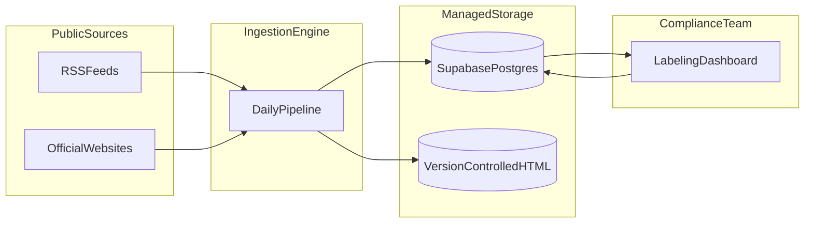

# ReadLogue — Solution Documentation

*Portfolio overview of a production regulatory intelligence platform.*

---

ReadLogue is a self-hostable system that automates how compliance teams discover, preserve, and prioritize regulatory content. Public sources are ingested on a schedule, validated for quality, archived with full provenance, and presented in a secure labeling dashboard where analysts apply structured judgments—all backed by an auditable data layer suitable for reporting and future AI integration.

This documentation describes **what the solution delivers** and **how the major components fit together**. It is written for stakeholders evaluating the platform: compliance leaders, technical reviewers, and prospective clients assessing delivery capability.

---

## System Overview

Regulatory publishing is fragmented across RSS feeds, agency websites, and official blogs. ReadLogue unifies that noise into a single operational picture: an indexed corpus in PostgreSQL, immutable HTML archives, and a team workspace for review and classification.

**The loop is deliberate:** ingestion writes forward; the dashboard writes human judgment back to the same production index. Nothing is lost in spreadsheets or email threads.

---

## Explore the Solution

| Document | What you will see |
| -------- | ----------------- |
| [**Ingestion Pipeline**](ingestion-pipeline.md) | How automated collection, validation, archival, and sync work—end to end |
| [**Labeling Dashboard**](labeling-dashboard.md) | How compliance officers review, filter, score, and classify incoming updates |
| [**Technical Specifications**](technical-specifications.md) | Architecture, stack, security model, and deployment topology at a glance |

---

## What Makes This Audit-Ready

| Capability | Business value |
| ---------- | -------------- |
| **Scheduled ingestion** | Regulatory scanning runs every day without manual effort |
| **Source archival** | Raw HTML preserved in version-controlled storage with date partitioning |
| **Quality gates** | Duplicates and low-quality content filtered before they reach analysts |
| **Structured labeling** | Read status, ratings, relevance scores, and taxonomy chips—stored with timestamps |
| **Failure visibility** | Ingestion issues surface in the dashboard; analysts can suppress noise without hiding problems |
| **Export-ready data** | Labeled corpus available for reporting, dashboards, or ML training (Phase 2) |

---

## About This Documentation

These pages are **portfolio-facing**: they explain the solution architecture and workflow, not day-to-day operator procedures. For internal development references, see [`UI_STRUCTURE.md`](../UI_STRUCTURE.md) and [`supabase/README.md`](../supabase/README.md).

---

## Contact

For inquiries about deployment, customisation, or Phase 2 integration:

**WizeIdea** — [https://wizeidea.com](https://wizeidea.com)

---

*ReadLogue: Compliance monitoring, automated. Audit-ready by design.*
