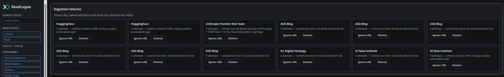
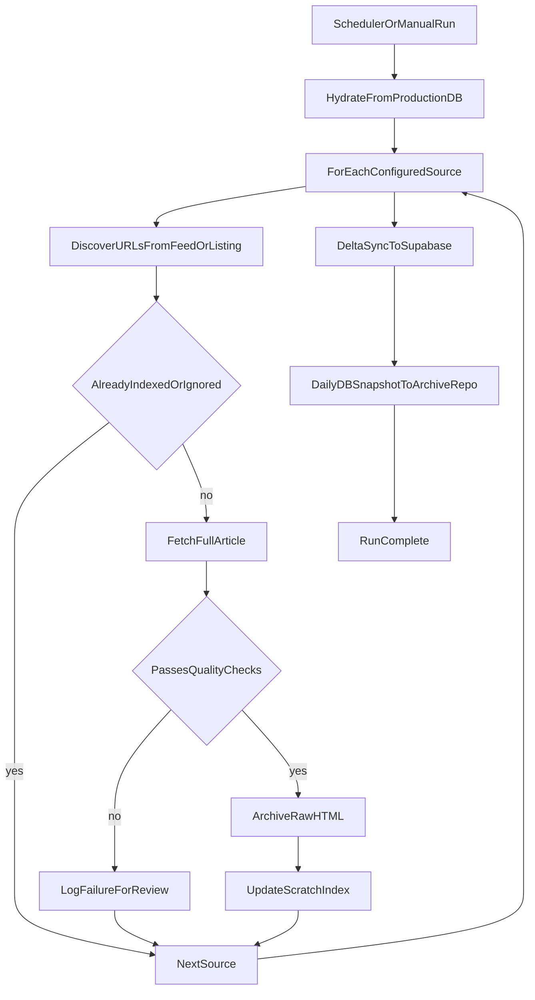

# Ingestion Pipeline

*Automated collection, validation, and archival of regulatory content.*

[← Back to solution overview](README.md)

---

## Purpose

Compliance teams cannot afford to miss a regulator's update because it was published on an obscure blog instead of a main gazette. The ingestion pipeline exists to **close that gap systematically**: it monitors dozens of configured public sources on a fixed schedule, extracts full article content, validates quality, and preserves both structured metadata and raw HTML—without requiring anyone to open a browser each morning.

The result is a **single, searchable index** that grows daily and carries a verifiable chain of custody for every captured source.

---

## What Runs Automatically

| Aspect | Detail |
| ------ | ------ |
| **Trigger** | GitHub Actions — daily schedule (configurable) plus on-demand manual runs |
| **Scope** | 40+ configured sources: RSS feeds, listing pages, and structured site profiles |
| **Operator effort** | Zero for routine runs — the pipeline is fully unattended |
| **Output** | New and updated articles synced to production PostgreSQL; raw HTML committed to a dedicated archive repository |

Each run begins by loading the current production state into a scratch workspace, so ingestion always works against the live corpus—never against stale local files.

---

## Quality Gates

Before content reaches the labeling dashboard, the pipeline applies multiple filters:

- **Deduplication** — URLs already indexed are skipped; no redundant fetches or storage
- **Ignore rules** — Configured URL patterns and analyst-managed suppressions prevent noise from re-entering the queue
- **Content validation** — Minimum word count, HTML residue checks, and lexical diversity thresholds reject snippets and boilerplate
- **Failure logging** — Rejected or unreachable articles are recorded with severity and message; nothing fails silently

Failures surface in the [labeling dashboard](labeling-dashboard.md#operational-visibility) so analysts can ignore recurring noise or dismiss resolved alerts—closing the loop without a separate ops queue.

When auditors ask *"How do you know you didn't miss something?"*, the answer is twofold: successful articles are archived with provenance, and failures are logged for human review.

---

## Provenance and Archival

Every successfully fetched article stores its **raw HTML** in a separate version-controlled repository, partitioned by publication date (`YYYY-MM-DD/`). Git commit history on that repository provides an independent audit trail—distinct from the operational database.

This design supports:

- Re-extraction if extraction rules improve later
- Demonstrating *what the source looked like* at capture time
- Regulatory evidence that content was preserved, not merely summarised

A daily SQLite snapshot is also rotated into the archive repository (7-day retention for dailies; permanent monthly copies on the first of each month).

---

## Efficient Production Sync

After ingestion completes, only **rows changed during that run** are pushed back to Supabase—new articles, updated metadata, and ingestion-log entries. Unchanged records are left untouched.

On a typical day with a handful of new articles, this means ~20 API operations instead of re-posting the entire corpus (~500+ rows). The pipeline stays fast, quiet, and cost-effective at scale.

---

## Pipeline Flow

---

## Business Outcomes

| Outcome | How the pipeline delivers it |
| ------- | ------------------------------ |
| **Reduced manual scanning** | Analysts start from a curated queue, not a blank browser tab |
| **Audit readiness** | Indexed articles + archived HTML + ingestion logs |
| **AI-ready foundation** | Clean, labeled corpus with full text and metadata for downstream models |
| **Operational transparency** | Failures visible in logs and dashboard—not buried in cron output |

---

## Related

- [Labeling Dashboard](labeling-dashboard.md) — where ingested content is reviewed and classified
- [Technical Specifications](technical-specifications.md) — stack, security, and deployment topology

---

## Contact

**WizeIdea** — [https://wizeidea.com](https://wizeidea.com)
