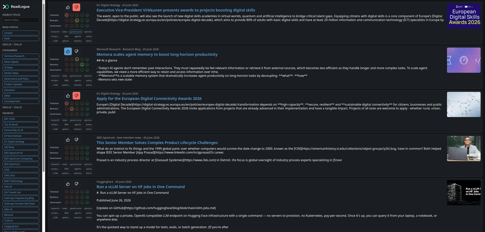
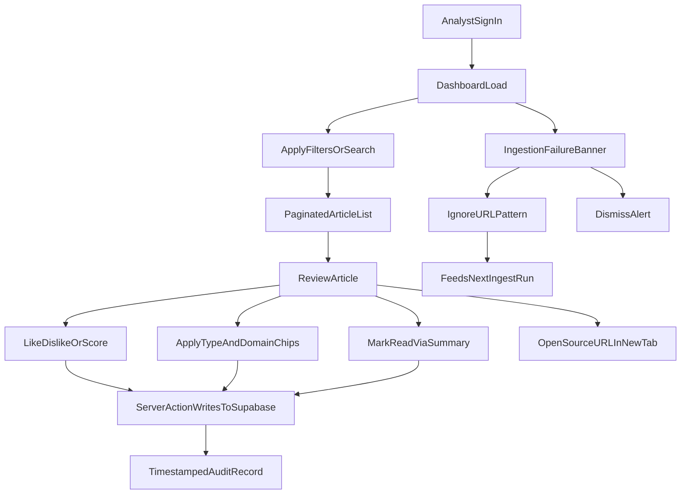

# Labeling Dashboard

*Where compliance teams turn raw regulatory updates into prioritized, auditable intelligence.*

[← Back to solution overview](README.md)

---

## Purpose

Automated ingestion solves the *collection* problem. The labeling dashboard solves the *judgment* problem: which updates matter, how urgent they are, and how they should be classified for reporting, escalation, or future machine-learning models.

The dashboard is a secure web application where authorised analysts review incoming articles, apply structured labels in seconds, and build a corpus of human decisions that auditors—and algorithms—can trust.

---

## Secure Access

Access is gated by **Supabase Authentication**. Unauthenticated visitors are redirected to a sign-in page; session state is refreshed on every request. All article reads and writes occur against row-level-secured PostgreSQL tables—the production index ingested by the pipeline.

There is no shared password, no exported spreadsheet, and no ambiguity about who changed what.

---

## The Review Workspace

The main screen presents a **paginated article list** with a persistent sidebar for navigation and filtering.

| Feature | What it enables |
| ------- | --------------- |
| **Category filters** | Narrow to Governance, Vendor News, Technical Research, and other configured taxonomies |
| **Source filters** | Focus on a specific regulator, lab, or publisher |
| **Read status** | Separate reviewed from pending items |
| **Title search** | Find articles by keyword across the indexed corpus |
| **Pagination** | Work through large volumes without performance degradation |

Filters compose via URL parameters—bookmarkable, shareable, and stable across sessions.

---

## Structured Judgment

Each article row supports a rich but fast labeling model designed for compliance workflows:

| Control | Purpose |
| ------- | ------- |
| **Read toggle** | Mark an item reviewed via the summary area; opening the source URL does not auto-mark read—analysts can read externally and curate before closing |
| **Like / Dislike** | Quick relevance signal for triage |
| **T / B / G scores** | Five-point relevance scale (Terrible → Great) for finer prioritisation |
| **Type chips** | Research, news, governance, opinion |
| **Domain chips** | LLMs, agents, policy, robotics, and other subject tags |
| **Category dropdown** | Assign or correct the operational category |
| **Hero image** | Visual context from Open Graph metadata where available |

Every interaction writes back to the production database with a timestamp—creating an **immutable audit trail** of the team's review process.

---

## Operational Visibility

When the ingestion pipeline cannot fetch or validate a source, the dashboard surfaces a **failure banner** at the top of the page. Analysts can:

- **Ignore** — add a URL pattern to the runtime suppress list (merged into the next ingest run)
- **Dismiss** — clear the alert without changing pipeline rules

This closes the loop between automated collection and human oversight: the team sees problems immediately and can act without filing a ticket to IT.

---

## Analyst Workflow

---

## Business Outcomes

| Outcome | How the dashboard delivers it |
| ------- | ----------------------------- |
| **Team alignment** | Shared queue with consistent taxonomy—no parallel email threads |
| **Measurable activity** | Read status and labels quantify review throughput |
| **Audit defensibility** | Timestamped decisions tied to authenticated users |
| **Export-ready corpus** | Labeled data exportable via the Python tooling layer for reporting or ML (CSV / JSONL) |

---

## Related

- [Ingestion Pipeline](ingestion-pipeline.md) — how content arrives in the dashboard
- [Technical Specifications](technical-specifications.md) — auth, data model, and hosting

---

## Contact

**WizeIdea** — [https://wizeidea.com](https://wizeidea.com)
