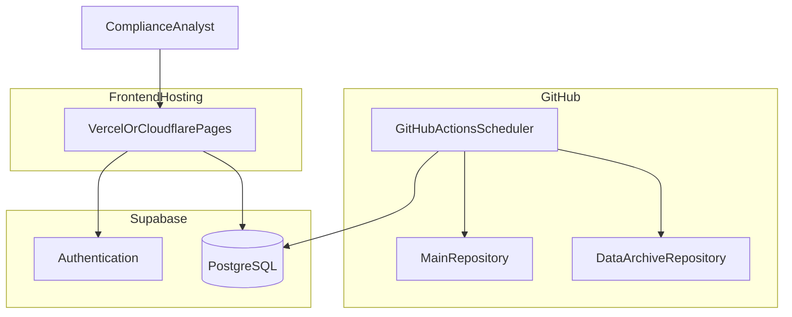

# Technical Specifications

*Architecture, stack, and deployment at a glance.*

[← Back to solution overview](README.md)

---

## Architecture Pattern

ReadLogue separates concerns across three managed surfaces:

| Surface | Role |
| ------- | ---- |
| **Main repository** | Application code, ingest configuration, GitHub Actions scheduler |
| **Data archive repository** | Version-controlled raw HTML and database snapshots |
| **Supabase project** | Production PostgreSQL index, authentication, row-level security |

The ingestion pipeline hydrates a scratch database from Supabase at the start of each run, processes new content locally, then syncs only changed rows back. The dashboard reads and writes the same production tables—there is no secondary "staging" copy for analysts to reconcile.

This pattern keeps **bulk HTML out of the database** (respecting storage limits) while maintaining a **single source of truth** for structured metadata and human labels.

---

## Technology Stack

| Layer | Technology | Purpose |
| ----- | ---------- | ------- |
| **Frontend** | Next.js, Tailwind CSS | Labeling dashboard and review UI |
| **Backend / API** | Supabase (BaaS) | Database, authentication, auto-generated REST API |
| **Database** | PostgreSQL (Supabase) | Articles, sources, curation, ingestion log, ignore rules |
| **Ingestion engine** | Python 3.11+ | Fetching, extraction, validation, export |
| **Scheduler** | GitHub Actions | Daily automated ingestion |
| **Raw HTML archive** | GitHub repository | Version-controlled, auditable source storage |
| **Hosting** | Vercel / Cloudflare Pages | Frontend deployment |

All components are designed to run on generous free or low-cost tiers—making the solution accessible to teams of any size without enterprise licensing overhead.

---

## Data Model (Conceptual)

| Entity | What it holds |
| ------ | ------------- |
| **Sources** | Configured feed or site identity (name, URL, scraper type) |
| **Items** | Articles: title, summary, full text, publication date, category, read status, rating, hero image, curation JSON |
| **Curation** | Per-article labels: relevance score, article type chips, domain chips |
| **Ingestion log** | Failed or rejected URLs with severity, message, and repeat count |
| **Ignored URLs** | Runtime suppress rules (exact or substring) managed from the dashboard |

Human labels live in the same `items` row as ingested content—no join across siloed systems when exporting for audit or ML.

---

## Security Model

| Control | Implementation |
| ------- | -------------- |
| **Authentication** | Supabase Auth (email/password; SSO-capable) |
| **Session management** | Middleware refreshes tokens; unauthenticated users cannot reach the dashboard |
| **Read access** | Row-level security policies for authenticated users on production tables |
| **Write access (UI)** | Server actions and API routes use service role for controlled mutations |
| **Write access (ingest)** | GitHub Actions secrets; service role key never exposed to the browser |
| **Data residency** | Client-controlled Supabase and GitHub projects—no third-party data processor for content |

Secrets (Supabase keys, deploy keys) are stored in GitHub Actions secrets—not in source control.

---

## Scalability Notes

| Dimension | Current posture |
| --------- | --------------- |
| **Corpus size** | ~500 indexed articles across 40+ sources |
| **Ingest frequency** | Daily by default; cron adjustable to hourly for time-sensitive environments |
| **Search** | Server-side title search via PostgreSQL `ILIKE`—appropriate at current scale |
| **Sync efficiency** | Delta sync pushes only changed rows per ingest run |
| **Archive growth** | HTML stored in git; date-partitioned paths keep retrieval predictable |

The architecture supports higher throughput without redesign: more sources are configuration, not code changes.

---

## Deployment Topology

---

## Extensibility (Phase 2)

The platform is intentionally modular for future capability:

| Direction | Hook |
| --------- | ---- |
| **ML prioritisation** | Labeled JSONL export; curation fields already structured |
| **RSS metadata stubs** | Ingest partial items when full fetch is blocked; manual import path in roadmap |
| **Slack / Teams digests** | Scheduled export or webhook from labeled corpus |
| **Multi-team RBAC** | Supabase roles and RLS policies |

See the [main README roadmap](../README.md#roadmap-phase-2) for the published timeline.

---

## Related

- [Ingestion Pipeline](ingestion-pipeline.md) — automated collection workflow
- [Labeling Dashboard](labeling-dashboard.md) — analyst review workflow

---

## Contact

**WizeIdea** — [https://wizeidea.com](https://wizeidea.com)
